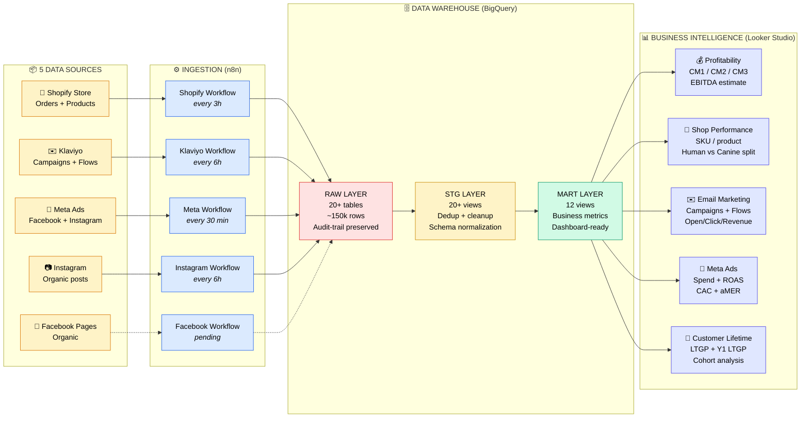

# Dr. Dobias Data Infrastructure — Architecture Overview

A single-page visual map of what's been built and what gets handed over. Designed to communicate scope at a glance.

---

## The full system at a glance



---

## Why three warehouse layers?

Industry-standard pattern (used by Spotify, Airbnb, Netflix internal stacks):

| Layer | Role | Why |
|---|---|---|
| **Raw** | Append-only floor of truth. Stores every fetch exactly as received from source APIs, with full audit trail. | If something's wrong downstream, we can always re-derive from raw. Never lose data. |
| **Stg** | Deduplication + cleanup. Picks the latest version of each record, removes garbage (Matrixify ghost orders, casing inconsistencies), normalizes schemas across platforms. | Downstream queries get clean data without having to know about source quirks. |
| **Mart** | Business-ready metric views. Pre-computed CM stack, AOV definitions, Y1 LTGP, etc. Looker reads exclusively from mart. | Dashboards stay fast, definitions stay consistent across charts, business logic changes happen in one place. |

Skipping any layer creates problems we've hit and fixed: data quality issues, performance issues, definition drift across dashboards.

---

## Metric inventory (what Peter actually sees on dashboards)

~50 documented business metrics, fully specified in `METRICS.md`. Headline ones:

### Profitability
- **Revenue** (net sales + shipping, ex-tax)
- **COGS, CM1, CM2, CM3** (monotonic D2C contribution margin stack)
- **EBITDA estimate** (CM3 − 30% OpEx)
- **Net sales, gross sales, tax collected** (for reconciliation)

### Order economics
- **AOV** (cart size, ex-shipping)
- **AOV new** / **AOV returning** (split by customer status)
- **New customer orders / Returning customer orders**

### Marketing efficiency
- **MER** (blended marketing efficiency)
- **aMER** (acquisition MER — new customer revenue / ad spend)
- **CAC** (cost per new customer)
- **Meta ROAS, CPC, CPA, CTR** (true period-correct values)

### Customer lifetime
- **Lifetime revenue / lifetime gross profit** (full available history)
- **Y1 LTGP** (maturity-corrected — first 365 days)
- **Cohort repeat rate** (true RCR, age-independent)
- **MoM new customer growth**

### Email marketing
- **Open rate, click rate, conversion rate** (correctly aggregated, not averaged-of-daily)
- **Revenue per email**
- Per-campaign + per-flow performance

### Per-product line (Dobias-specific)
- **Human Line vs Canine Line** revenue/margin/units split

---

## What runs autonomously after deployment

| Workflow | Cadence | What it does |
|---|---|---|
| Shopify | every 3 hours | Pulls new orders + updated order statuses |
| Klaviyo | every 6 hours | Refreshes campaign + flow performance (running window) |
| Meta Ads | every 30 minutes | Pulls campaign & ad performance (rolling 30-day window) |
| Instagram | every 6 hours | Organic post metrics |

Zero manual work for normal operation. Failures trigger alerts.

---

## What was tackled (real engineering work, not configuration)

The architecture diagram looks clean. The path to clean took 30+ engineering decisions resolved through investigation. Highlights:

| Issue surfaced & resolved | Investigation type |
|---|---|
| Shopify "Matrixify" ghost orders inflating revenue by 60% | Source forensics + filter design |
| Meta API deprecation of static tokens (Jan 2026) | Auth model rewrite (OAuth client-credentials) |
| Pre-divided ratios silently misaggregating in Looker (ROAS 3.35 vs 4.08 true) | Mart layer redesign, calc-field documentation |
| Cumulative-snapshot flow data → $113M phantom revenue | Latest-snapshot pattern in mart views |
| Klaviyo metadata-only API → missing performance metrics | Separate reports endpoint integration, 24-month backfill |
| Customer-flag drift between Shopify and warehouse (174-order discrepancy) | Email-based derived flag, full reconciliation |
| Maturity bias in LTV scorecards | Y1 metric design (first-365-days), proper cohort comparison |
| Margin >100% scorecards (markup vs margin confusion) | Documentation + calc-field convention |
| Currency mixing across multi-client data (ROAS 2.30 vs 4.08) | Page-filter convention as a Hard Rule |

This is what "data infrastructure" costs — not the lines of code, but the diagnostic + iteration cycles that make the numbers trustworthy.

---

## File structure (what's handed over)

```
infra/
  bigquery/        — 16 DDL files (raw, stg, mart layers)
  n8n/             — 7 workflow JSON files (ready to import)
  samples/         — API response samples used to design schemas
runbooks/          — 17 step-by-step procedures (backfills, setup, debugging)
infra/shopify_bulk_transform.py     — Shopify bulk-data Python helper
infra/shopify_products_transform.py — Same for products
METRICS.md         — Living dictionary of every business metric + formula
PROJECT_LOG.md     — Chronological change history with reasoning
CLAUDE_CODE_BRIEF_V3.md — Detailed onboarding for any engineer taking over
```

All in version control (GitHub). Anyone taking this over can read the change log and onboarding doc to ramp.

---

## Bottom line

The system is **not 'a couple of API calls glued together.'** It's a real warehouse stack with:
- 5 ingestion pipelines, each with its own auth, rate limits, error handling
- 3-tier data architecture with audit trail
- 50 documented business metrics, definitions reconciled to source platforms
- Multi-week diagnostic work to make every number match Shopify/Klaviyo/Meta within tolerance
- 17 operational runbooks for non-routine tasks

Migrating it cleanly takes 5-6 weeks of focused engineering. Maintaining it requires ~5 hours/week of attention from someone who knows it, or a managed-service relationship.

Both viable. Both have costs. Worth deciding consciously, not on a "by end of week" reflex.
